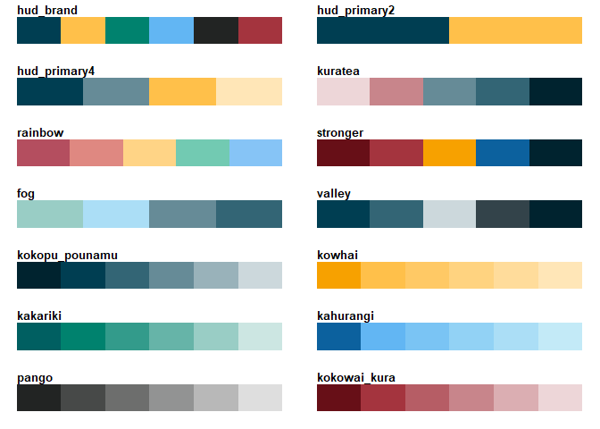

<!-- README.md is generated from README.Rmd. Please edit that file -->

# HUD Brand Color palettes

This is a package forked from jkaupp/nord.

Adapted with Ministry of Housing and Urban Development (New Zealand)
brand colours.

## Installation

You can install the current version of hud_palettes from github with:

(eventually, to be moved to hud-govt-nz)

``` r
# install.packages("devtools")
devtools::install_github("saera-chun-hud/hud-palettes")
```

## The Palettes of `hud_palettes`

``` r
library(hud.palettes)
library(purrr)
#> Warning: package 'purrr' was built under R version 4.3.3

par(mfrow = c(7, 2), lheight = 2, mar = rep(1.5, 4), adj = 0)

walk(names(hud_palettes), hud_show_palette)
```



## Example

This is a basic example which shows you how to use the different
features in `hud_palettes`:

Here is how to use `scale_fill_hud()` with `ggplot2`

``` r
library(ggplot2)
#> Warning: package 'ggplot2' was built under R version 4.3.3
library(hud.palettes)

ggplot(diamonds) + 
  geom_bar(aes(x = cut, fill = clarity)) +
  scale_fill_hud("stronger")
```


Here is using the `hud_col` function, with built in colour-ramping, with
the obligatory base r volcano.

``` r
image(volcano, col = hud_col("rainbow", 20))
```


You can view the individual palettes in `hud_palettes` via
`hud_show_palette()`

``` r
hud_show_palette("kakariki")
```


## Acknowledgements

1.  Full credit to Jake Kaupp (<https://github.com/jkaupp/>).
2.  You can read HUD Brand Guidelines in Kete for more information on
    how to use HUD branding correctly.
3.  Joe Winton’s DRAFT D&P Power BI Dashboard standards (Can be found in
    Data & Products folder).
